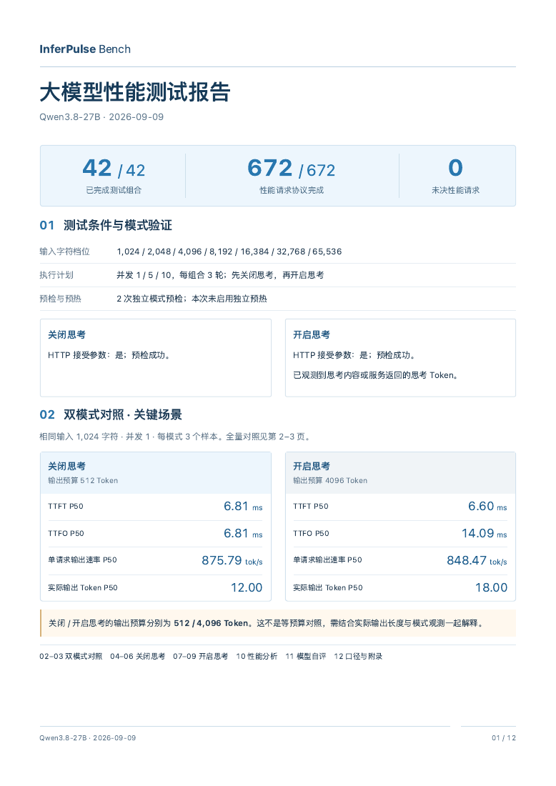

# InferPulse Bench

**Zero-dependency performance testing for self-hosted LLM services.**

[简体中文](README.md) · [English](README.en.md) · [GitHub](https://github.com/Siriuser/inferpulse-bench) · [Gitee](https://gitee.com/xum1983/inferpulse-bench)

面向本地部署与内网交付的大模型性能测试工具。一个 Python 文件，填写连接信息即可测量首响应、生成速度、并发与长上下文表现，生成可离线查看和复核的 Markdown / HTML 报告。

**Python 3.9+ · 零第三方运行依赖 · MIT · Author: William Xu**

[下载稳定版 1.9.0](https://github.com/Siriuser/inferpulse-bench/releases/tag/v1.9.0) · [试用 1.10.0 Agent 预发布版](https://github.com/Siriuser/inferpulse-bench/releases/tag/v1.10.0) · [使用说明](使用说明.md) · [报告问题](https://github.com/Siriuser/inferpulse-bench/issues)

## 可以测什么

| 场景 | 主要结果 |
| --- | --- |
| 常规性能 | TTFT、TTFO、请求耗时、单请求与聚合 tok/s、服务返回的 Token 用量 |
| 长上下文与并发 | 字符档位 × 并发 × 思考模式矩阵，P50/P95、成功率、失败与截断、劣化位置和文字分析 |
| 思考模式对照 | 参数方案、模式证据、off/on 数据对照；支持 Qwen 与 DeepSeek 兼容参数方案 |
| Agent 性能（1.10.0） | 常规基线引用、缺档补测、并发工具 Loop、逐轮工具就绪时间、完整流程耗时及可选 PNG/WAV 输入 |
| 报告与复核 | MD/HTML 默认同时生成，HTML 平铺展示与 A4/PDF 打印，证据离线重建，可选模型自评 |

Agent 专项默认关闭，不要求开启 Thinking，单独统计并在报告中形成“Agent 能力评估”。流程完成与性能数据不代表业务答案质量。当前源码为 1.10.0 预发布版，稳定发布为 1.9.0；Gitee 当前仍提供 1.9.0。

## 快速开始

1. 下载运行 ZIP 并解压，或克隆仓库。
2. 将 `llm_benchmark.qwen.example.jsonc` 或 `llm_benchmark.deepseek.example.jsonc` 复制为 `llm_benchmark.jsonc`；运行包已包含空 Key 默认配置。
3. 填写模型名称、完整的 `/v1/chat/completions` 地址和 API Key。
4. 在目录中执行：

```bash
python3 llm_benchmark.py --dry-run
python3 llm_benchmark.py
```

Windows 可将 `python3` 替换为 `python`。无需安装依赖，不需要云端控制台。

第一次试跑可使用下面的完整小配置，地址、名称和参数方案按实际服务填写：

```jsonc
{
  "schema_version": "inferpulse.standalone.config/v1",
  "model": {
    "name": "your-model-name",
    "thinking_adapter": "qwen",
    "api_url": "http://127.0.0.1:8000/v1/chat/completions",
    "api_key": ""
  },
  "thinking_modes": ["off"],
  "input_characters": [1024],
  "concurrency": [1],
  "repetitions": 1,
  "warmup": {"enabled": false, "requests_per_length": 1},
  "self_review": false
}
```

该配置最多 1 次预检和 1 次性能请求。`thinking_adapter` 为 `qwen` 时发送 Qwen 参数方案，为 `deepseek` 时发送 DeepSeek 参数方案；默认 `auto` 根据名称识别，部署别名可显式指定。服务是否接受由预检确认，不会通过删除参数后重试来伪装支持。

## Agent 性能专项

在现有 JSONC 顶层增加：

```jsonc
"agent_performance": {
  "enabled": true,
  "scenarios": ["long_context", "loop"],
  "concurrency": [1, 5, 10],
  "repetitions": 3
}
```

默认测 8192 / 32768 / 65536 / 131072 字符长输入，以及每会话 10 次模型调用的固定工具 Loop。符合条件的常规单轮结果只引用，缺档补测；工具 Loop 和图片/音频须独立实测。默认双模式与常规矩阵下最多新增 1084 次模型请求，先用 `--dry-run` 核对规模；入门试跑建议缩小档位、并发和轮数。

报告提供数值表、逐轮趋势、思考对照、20% 描述性劣化关注点及可选业务目标对照。缺 usage 或窗口未决时不伪造吞吐；工具参数不冒充最终回答，不执行模型生成的命令或外部工具。

[专项配置与指标定义](docs/AGENT_PERFORMANCE.md) · [完整使用说明](使用说明.md)

## 报告预览与格式

[HTML 示例](report.example.html) · [PDF 示例](report.example.pdf) · [Markdown 示例](report.example.md)



仓库示例是使用合成数据的 12 页设计原型，不是模型性能成绩；实际报告随运行数据生成，页数可变。1.10.0 的 Agent 动态报告已完成 Chrome A4 长表打印检查，曲线为内联 SVG，无需外部资源。打印时使用 A4 纵向、100% 比例，并关闭浏览器额外页眉页脚。

```jsonc
"report_formats": [
  "md",   // 注释此行可关闭 Markdown
  "html", // 注释此行可关闭 HTML
]
```

至少保留一种；省略字段默认两种都生成。需要重建时：

```bash
python3 llm_benchmark.py report --input llm_benchmark_evidence_实际目录
```

离线重建不重新请求模型，不读取后来修改的配置；专项媒体源文件也无需保留在报告旁。

## 测量与隐私边界

- 字符档位不是精确 Token；Token 来自服务 usage，缺失不估算。客户端观测不等于 GPU 纯解码速度。
- P95 属于当前样本的经验分位数，最高已测并发不是容量上限，性能测试不等于准确率或能力认证。
- 思考参数接受不等于思考状态已证实；不同预算和实际输出长度应一起解释。
- 压测正文、思考内容、工具正文、媒体文件及 API Key 不写入证据。模型自评开启时会保存最终自评文字。
- 本地运行配置以明文保存 Key，请勿上传。报告和元数据也应在分享前检查。

## 验证与贡献

Python 3.9 / 3.13 各 112 项本机模拟服务回归通过，覆盖失败、取消、未决证据、格式选择、工具 Loop、多模态载荷与隐私；运行包解压运行和离线重建通过。Agent 的真实模型协议及图片/音频服务兼容性尚未验收，请以实际预检和结果为准。

```bash
python3 -m unittest discover -s tests -p 'test_standalone*benchmark.py'
```

欢迎提交推理框架兼容性反馈、经过脱敏的复现步骤和文档改进。详见 [贡献指南](CONTRIBUTING.md)。Bench 是独立脚本产品，与完整 InferPulse 桌面产品分别管理源码、版本与许可。

[MIT License](LICENSE) · [☕ 支持作者](SPONSOR.md) · [xum1983@gmail.com](mailto:xum1983@gmail.com)
